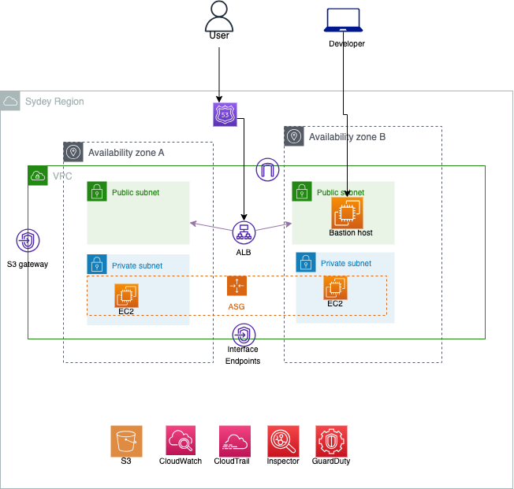

## Belong Platform Engineering Coding Challenge Solution ##
### Overview ###
This repository contains AWS CloudFormation templates that provide a solution to the Belong Platform Engineering Coding Challenge. The challenge involves creating a standard, secure AWS infrastructure with specific requirements.

### Infrastructure Components ###

The solution consists of two main components:
#### 1. Network Infrastructure (network.yaml) ####
This template sets up the foundational network infrastructure within AWS:

- VPC: A dedicated Virtual Private Cloud (VPC) with CIDR block 10.0.0.0/16.
- Subnets:
    Public Subnets: Two subnets (10.0.0.0/18 and 10.0.64.0/18) with internet access.
    Private Subnets: Two subnets (10.0.128.0/18 and 10.0.64.192/18) without direct internet access.
- Internet Gateway: For outbound internet access from the public subnets.
- NAT Gateway: To enable outbound internet access for instances in the private subnets.
- Gateway Endpoint: To enable ec2 server to download file from s3.
- Interface Endpoint: enable ec2 server to create cloudwatch logs.

#### 2. Application Infrastructure (app.yaml) ####
This template creates the resources required to host and manage the application:

- EC2 Launch Template: Configures EC2 instances in the private subnet, running httpd service. The time zone of these instances is set to AEST (Australian Eastern Standard Time).
- Auto Scaling Group: Maintains the desired count of EC2 instances and automates their creation in the private subnets.
- Bastion Host: An EC2 instance in the public subnet for developer to access via session manager, then use exisintg  SSH access to EC2 server in the private subnet.
- Auto Scaling Group (ASG):
  Manages the scaling and health of EC2 instances in the private subnet. Works in conjunction with the Application Load Balancer for traffic distribution and health checks.
- Application Load Balancer (ALB): Routes traffic to the EC2 instances and performs health checks.
### TODO ###
- ADD CloudTrail, aws inspector and guardduty